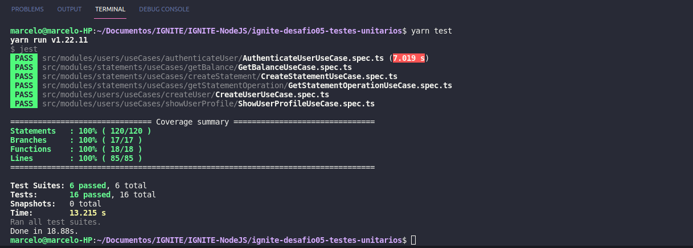

# ignite-desafio05-testes-unitarios

# Chapter IV
## Desafio 01 - Testes unitários

💻 Sobre o desafio

Foi criado um testes unitários para uma aplicação já pronta usando tudo que aprendeu até agora sobre testes.

Template da aplicação:
https://github.com/rocketseat-education/ignite-template-tests-challenge

Instalação:
yarn add jest @types/jest -D

yarn jest --init

yarn add supertest @types/supertest -D

yarn add ts-jest

<h1 align="center">
    
</h1>

## Banco de dados

Se você quiser testar a aplicação usando o Insomnia para ver o funcionamento até mesmo como auxílio para criar os testes unitários, é importante que você confira os dados de autenticação do banco no arquivo `ormconfig.json` e, se necessário, altere.

Além disso você precisa criar uma database com o nome `fin_api` de acordo com o que está no arquivo de configurações do TypeORM.

## Rotas da aplicação

Para te ajudar a entender melhor o funcionamento da aplicação como um todo, abaixo você verá uma descrição de cada rota e quais parâmetros recebe.

### POST `/api/v1/users`

A rota recebe `name`, `email` e `password` dentro do corpo da requisição, salva o usuário criado no banco e retorna uma resposta vazia com status `201`.

### POST `/api/v1/sessions`

A rota recebe `email` e `password` no corpo da requisição e retorna os dados do usuário autenticado junto à um token JWT.

Essa aplicação não possui refresh token, ou seja, o token criado dura apenas 1 dia e deve ser recriado após o período mencionado.

### GET `/api/v1/profile`

A rota recebe um token JWT pelo header da requisição e retorna as informações do usuário autenticado.

### GET `/api/v1/statements/balance`

A rota recebe um token JWT pelo header da requisição e retorna uma lista com todas as operações de depósito e saque do usuário autenticado e também o saldo total numa propriedade `balance`.

### POST `/api/v1/statements/deposit`

A rota recebe um token JWT pelo header e `amount` e `description` no corpo da requisição, registra a operação de depósito do valor e retorna as informações do depósito criado com status `201`.

### POST `/api/v1/statements/withdraw`

A rota recebe um token JWT pelo header e `amount` e `description` no corpo da requisição, registra a operação de saque do valor (caso o usuário possua saldo válido) e retorna as informações do saque criado com status `201`.

### GET `/api/v1/statements/:statement_id`

A rota recebe um token JWT pelo header e o id de uma operação registrada (saque ou depósito) na URL da rota e retorna as informações da operação encontrada.

https://www.notion.so/Desafio-01-Testes-unit-rios-0321db2af07e4b48a85a1e4e360fcd11

